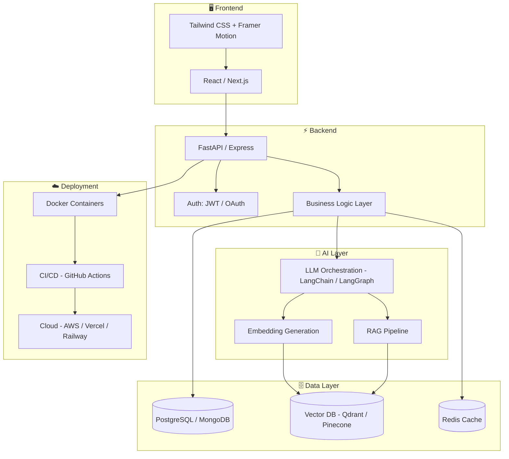

### AI Engineer&nbsp;•&nbsp;Backend Engineer&nbsp;•&nbsp;Full Stack Developer

I design and ship **production-grade AI systems**, **scalable backend architectures**, and **modern full-stack applications** — from raw idea to deployed infrastructure.

 

 

 

 

## 🧭 About Me

I'm a software engineer who builds systems that sit at the intersection of **artificial intelligence** and **production infrastructure**. My work spans the full stack — from crafting responsive front-end experiences, to designing secure and performant APIs, to architecting the retrieval and reasoning pipelines that power modern AI products.

**Who I am**
A backend-leaning full stack engineer with a deep focus on Generative AI. I care about systems that are correct, observable, and boring in the best way — because boring, predictable infrastructure is what lets AI features feel magical on top of it.

**What I build**
Production AI platforms powered by LLMs, semantic search, and Retrieval-Augmented Generation; scalable FastAPI backends; and full-stack web applications with clean, maintainable architecture.

**What I enjoy**
Designing systems from first principles, debugging distributed systems at 2 a.m., reading model papers over coffee, and turning a vague product idea into a well-typed, well-tested API contract.

**My engineering philosophy**
Ship small, measure everything, and never let complexity hide behind a demo. I'd rather have a boring, correct system than a clever, fragile one.

 

## 🎯 Current Focus

<table align="center">
<tr>
<td width="33%" align="center">

### 🌊 OceanGPT
Oceanographic intelligence platform powered by LLMs, RAG & semantic search

</td>
<td width="33%" align="center">

### 🤖 AI Agents
Designing autonomous, tool-using agents with structured reasoning

</td>
<td width="33%" align="center">

### 🔍 RAG Systems
Building retrieval pipelines with vector search & re-ranking

</td>
</tr>
<tr>
<td width="33%" align="center">

### ⚡ FastAPI
High-performance async backend services & APIs

</td>
<td width="33%" align="center">

### 🏗️ System Design
Distributed, cloud-native architectures at scale

</td>
<td width="33%" align="center">

### 🌱 Open Source
Contributing to and maintaining developer tools

</td>
</tr>
</table>

 

## 💼 Experience

| Period | Role | Focus |
|:---|:---|:---|
| **2024 — Present** | AI Engineer &amp; Backend Developer | LLM-powered platforms, RAG pipelines, FastAPI microservices |
| **2023 — 2024** | Full Stack Developer | React / Next.js front ends with scalable Node &amp; FastAPI backends |
| **2022 — 2023** | Backend Developer (Foundations) | REST APIs, relational &amp; NoSQL databases, authentication systems |

 

## 🧠 AI Expertise

 

## ⚙️ Backend

 

## 🎨 Frontend

 

## 🈯 Languages

 

## 🗄️ Databases

 

## ☁️ Cloud &amp; DevOps

 

## 🛠️ Tools

 

 

## 🚀 Featured Projects

<table align="center" width="100%">
<tr>
<td width="50%" valign="top">

<h3 align="center">🌊 OceanGPT</h3>

<b>Production-grade oceanographic AI intelligence platform</b>

**Description**
A production-grade AI platform for oceanographic intelligence powered by Large Language Models, semantic search, Retrieval-Augmented Generation, and scalable backend architecture.

**Key Features**
- LLM-driven natural language querying over oceanographic datasets
- RAG pipeline with vector-based semantic retrieval
- Scalable async FastAPI backend
- Modular, extensible data ingestion layer

**Tech Stack**
`Python` · `FastAPI` · `LangChain` · `Vector DB` · `PostgreSQL` · `Docker`

**Architecture:** Retrieval-augmented, microservice-based, cloud-deployable

**Status:** 🟢 Active Development

</td>
<td width="50%" valign="top">

<h3 align="center">🧩 SmartsAlgo</h3>

<b>LeetCode-inspired competitive coding platform</b>

**Description**
A coding platform inspired by LeetCode with authentication, coding environment, leaderboards, and modern full-stack architecture.

**Key Features**
- Secure JWT-based authentication system
- In-browser coding environment with real-time execution
- Global leaderboards and progress tracking
- Modern, responsive full-stack UI

**Tech Stack**
`React` · `Node.js` · `Express` · `MongoDB` · `Tailwind CSS`

**Architecture:** Full-stack MVC with REST APIs

**Status:** 🟢 Active Development

</td>
</tr>
</table>

 

## 🏗️ System Architecture

 

## 📊 GitHub Statistics

 

 

 

## 🐍 Contribution Snake

Generated via the <code>Platane/snk</code> GitHub Action — add the workflow to your profile repository to activate.

 

## 🏆 Achievements

<table align="center">
<tr>
<td align="center" width="25%">

**🌟 Consistent Contributor**
Active daily contributions across multiple repositories

</td>
<td align="center" width="25%">

**🚀 Production AI Systems**
Shipped LLM-powered platforms end-to-end

</td>
<td align="center" width="25%">

**🧩 Full Stack Delivery**
Owned projects from database schema to deployed UI

</td>
<td align="center" width="25%">

**📚 Continuous Learner**
Always exploring the latest in AI &amp; systems engineering

</td>
</tr>
</table>

 

## 📜 Certifications

| Timeline | Focus Area |
|:---:|:---|
| **2024** | Generative AI &amp; Large Language Models |
| **2023** | Backend Development with FastAPI |
| **2023** | Full Stack Web Development |
| **2022** | Data Structures &amp; Algorithms |

 

## 🌱 Open Source

I contribute to open-source developer tools and AI libraries, and maintain personal projects that explore the intersection of LLMs and backend infrastructure. I believe in writing code that others can read, extend, and learn from — clear commit history, documented APIs, and honest READMEs included.

 

## 🧭 Coding Philosophy

> Good software is not the software with the most features — it is the software that does exactly what it promises, every single time.

I optimize for **clarity over cleverness**, **correctness over speed of typing**, and **systems that fail loudly** rather than silently. Every API I design starts with a contract; every AI pipeline I build starts with an evaluation set.

 

## ⚡ Fun Facts

- 🌊 Named my flagship AI project after the ocean — because good retrieval feels like navigating deep water
- ☕ Debug best with coffee and worst with silence
- 🧩 Enjoy system design problems more than LeetCode (but still respect LeetCode)
- 🌙 Most productive during late-night deep work sessions

 

### 💬

> *"Building software isn't just writing code — it's solving real-world problems with scalable engineering and continuous learning."*

 

Thanks for stopping by — feel free to connect, collaborate, or just say hi 👋

